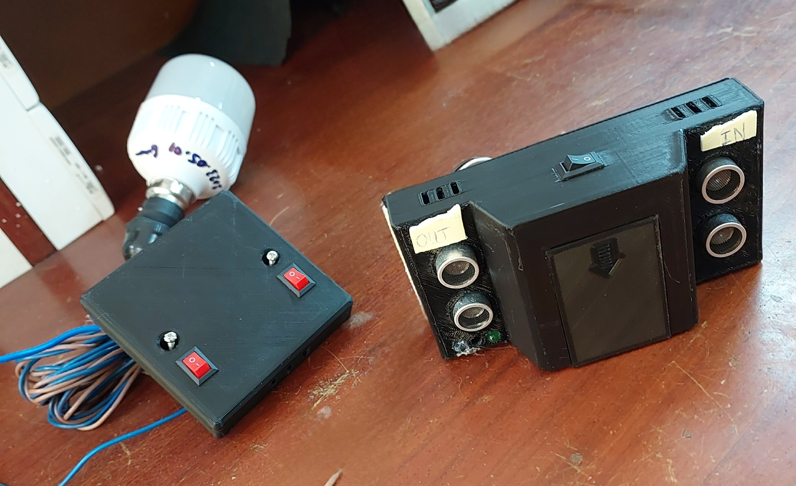
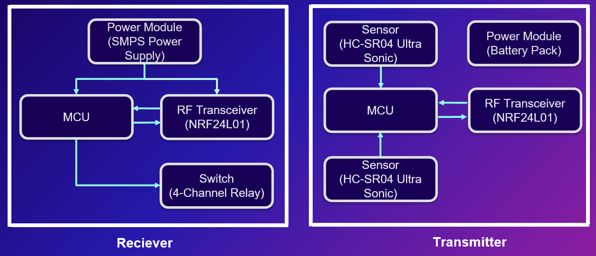
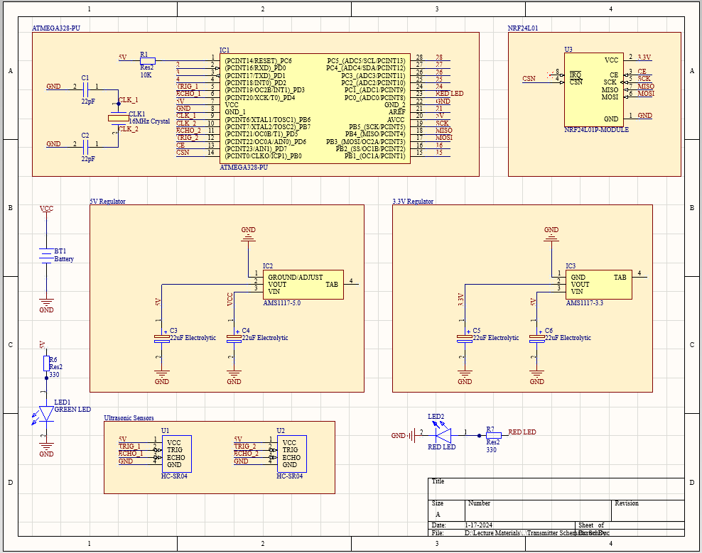
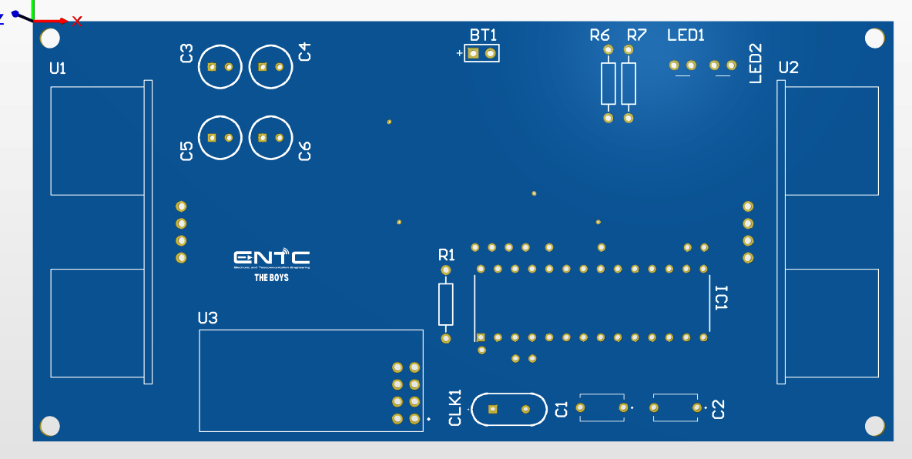
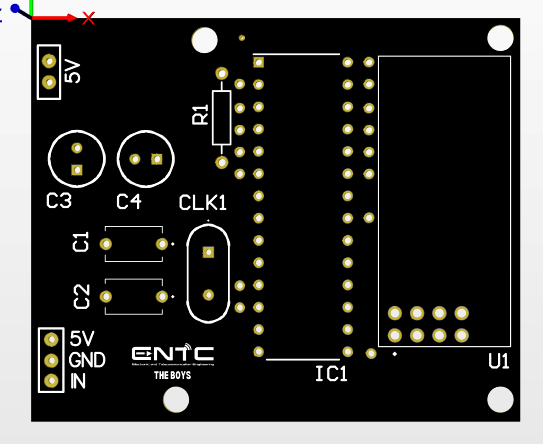
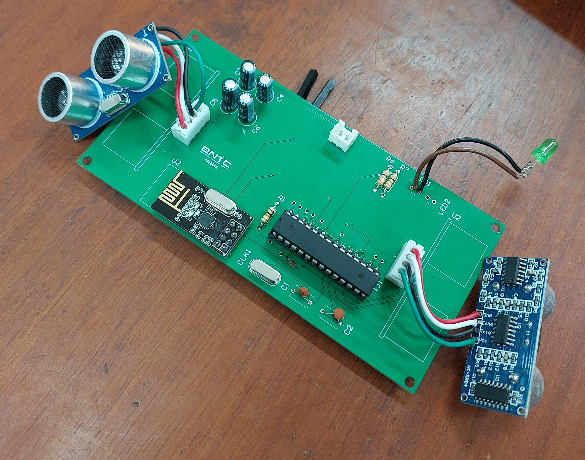
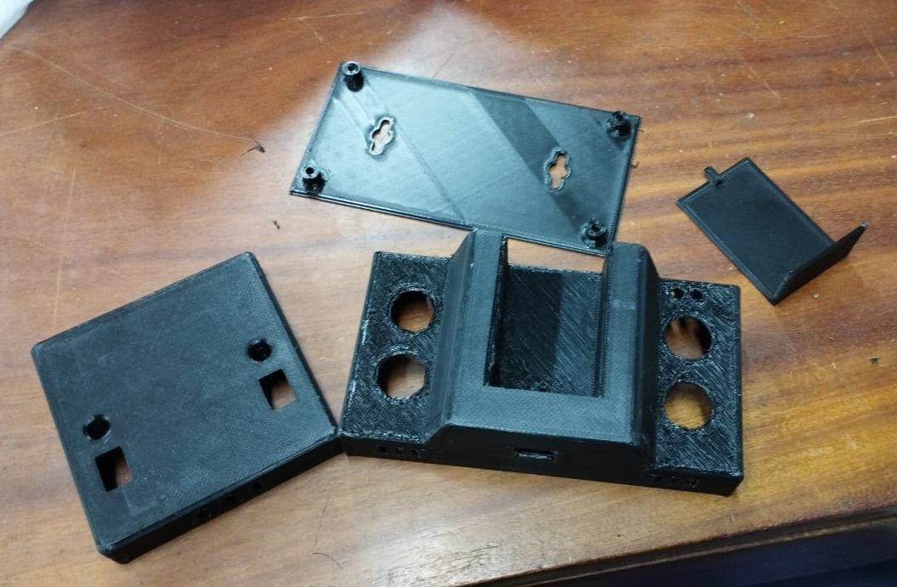
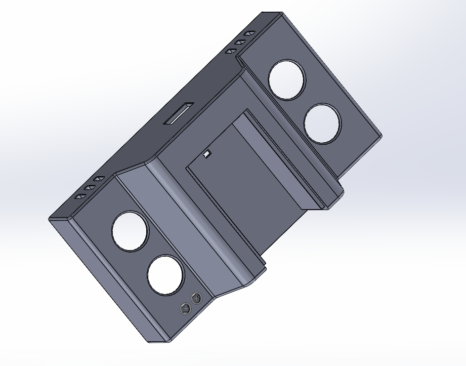
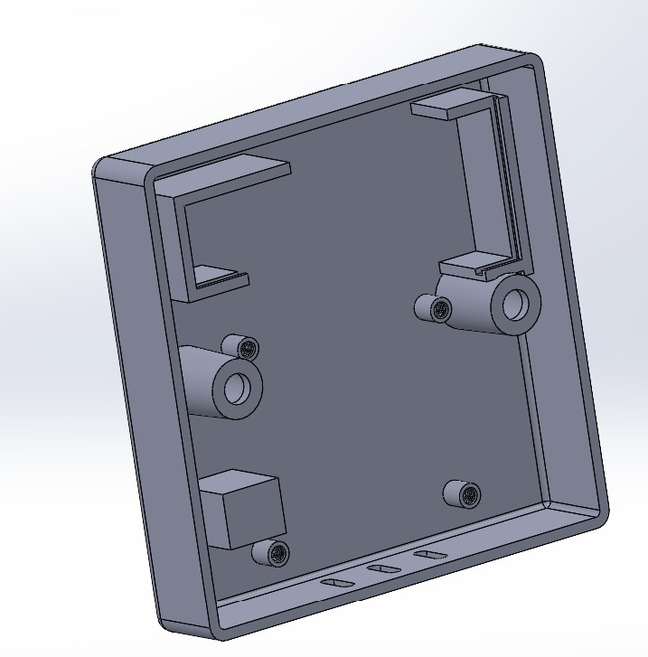

<!-- ABOUT THE PROJECT -->
 Killer Switch
 =================

  

Table of contents
=================

<!--ts-->
   * [Abstract](##Abstract)
   * [Introduction](#Introduction)
   * [Code](#Code)
   * [Schematic & PCB](#Schematic-&-PCB)
   * [Enclosure](#Enclosure)
   * [Contributors](#Contributors)
<!--te-->

## Abstract
This project was undertaken as part of the EN2091 Module, specifically in fulfillment of the "Analog Design Project". The objective of this project was to deepen our foundational understanding of analog electronics and expose us to the challenges within that domain. As per those requirements, we built this device mostly out of analog electronic components such as opamps, diodes and transistors. After referring many sources such as Journals and Videos,
* The initial simulations were made using Proteus and LTspice, then the circuit was transferred to the breadboard for further testing.
* The components were carefully selected according to our needs and by trial and error.
* The PCB was designed in Altium Designer.
* The enclosure was designed in Solid Works.

## Introduction 

  

## Code

## Schematic & PCB
We have designed two different PCB's for the transmitter and the reciever. The schematic of the PCB was drawn initially by hand and then was transferred into a standard schematic accordingly using Altium. The PCB was made as small as much as possible to fit into commonly used placement brackets. This is a two layered PCB Design which utilizes power and ground copper pours for signal integrity. Standard footprints from reputed manufacturers were used to ensure quality.

  

* Components were sourced locally and the pcb was printed abroad.

  
&nbsp; &nbsp; &nbsp; &nbsp;
  

* Since all the components were THC, they were carefully hand soldered.

  
&nbsp; &nbsp; &nbsp; &nbsp;
  

## Enclosure
* Enclosures were designed using Solid Works CAD software and 3D printed locally.
  

  

* Transmitter enclosure has two holes in each side to accommodate the ultrasonic sensors.
* Middle parts is made removable to change batteries.

  

* Reciever enclosure was made to fit into a regular switch cutout in the walls.

  

  
## Contributers

* Jazoolee Ahamed - [LinkedIn](https://www.linkedin.com/in/jazoolee-ahamed/)
* Abithan Asokumar - [LinkedIn](https://www.linkedin.com/in/abithan-asokumar-b6b132227/)
* Priyankan Vettivel - [LinkedIn](https://www.linkedin.com/in/priyankan-vettivel-262559212/)
* Thamirawaran Sathiyalogeswaran - [LinkedIn](https://www.linkedin.com/in/thamirawaran/)
